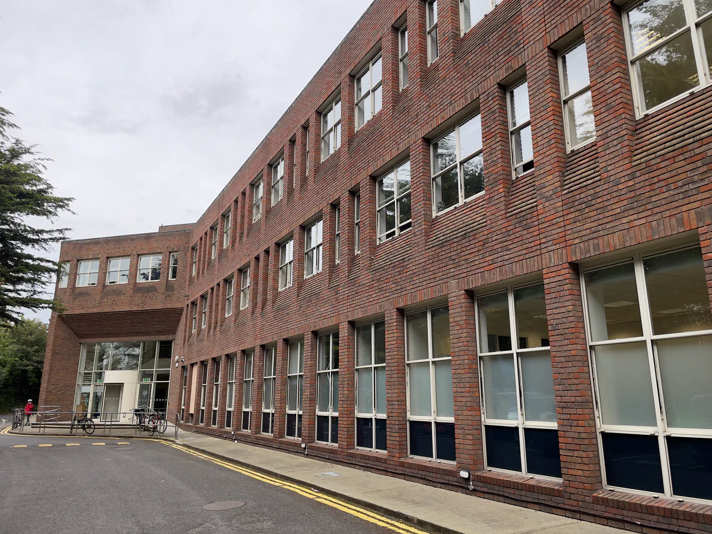
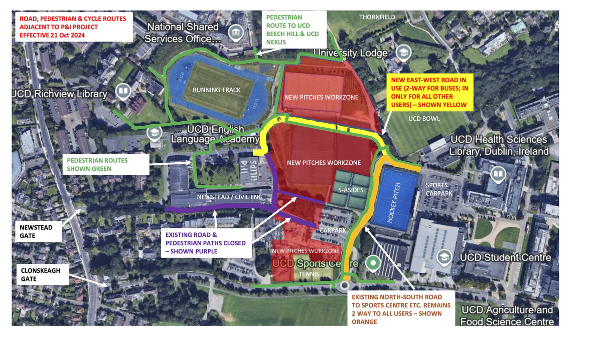

# Beech Hill

The UCD School of Physics has relocated to the L.M.I. Building in
Beech Hill from September 2023 whilst the Science Phase III upgrade is
in progress.

This building is just beyond the edge of campus, less
than 200 m from UCD Nexus.

The Stage 3 and Stage 4 Advanced Laboratories are now located in the
L.M.I Building, Beech Hill, on the ground and first floors of the B
wing.

/// caption
L.M.I. Building Beech Hill
///

## Vidoes

Gary Dunne (UCD Science) has created the following videos for the walk to/from the Science Centre on campus:

* [Beech Hill to Centre](https://drive.google.com/file/d/1almC-Vc3cbYwndlg4NnLpCBVFkVg74OI/view)

* [Centre to Beech Hill](https://drive.google.com/file/d/1iq5A1XQ0_IN04UjrVgWKcjMOzwmGHOQp/view)

## Address

The full address of the School of Physics in Beech Hill is:

UCD School of Physics 
L.M.I. Main Building 
Beech Hill Road 
Dublin 4 
D04 P7W1

## Building location on Google Maps

[Google map link to building](https://goo.gl/maps/YLSySLXPLkqseiSV9)

## Pedestrian route from the main Belfield campus

From 21 October 2024 there is a new pedestrian route to/from campus:

